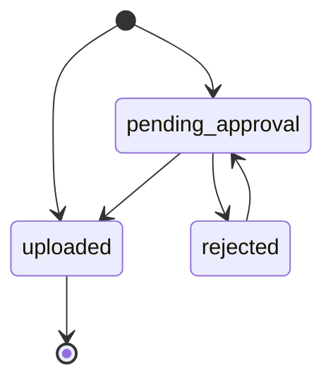
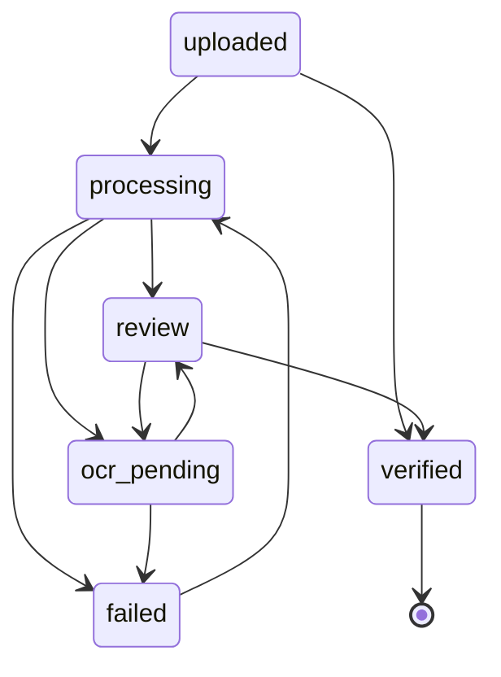
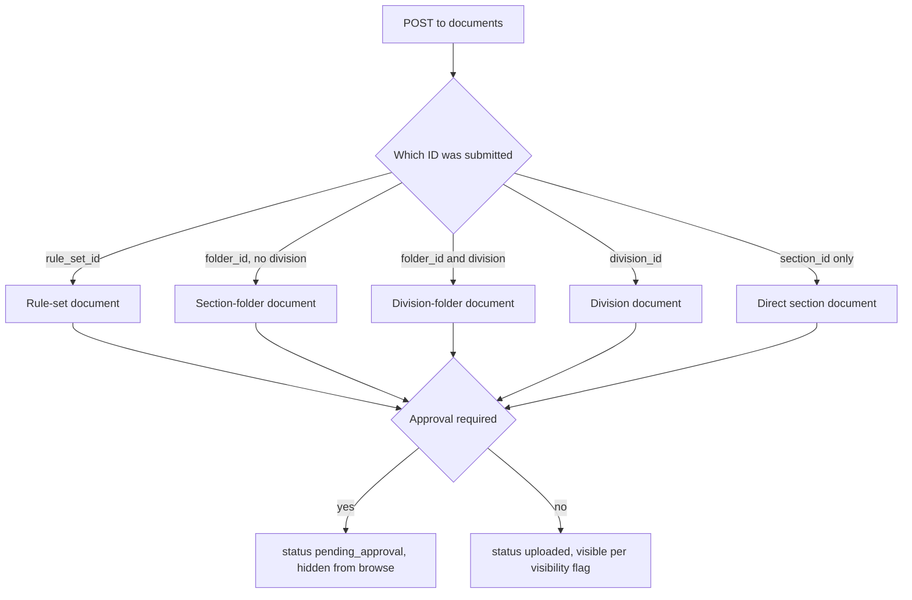
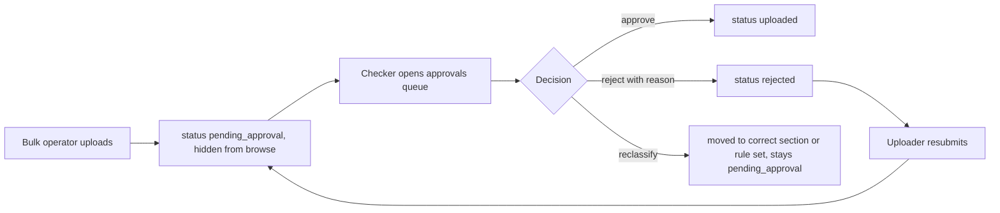
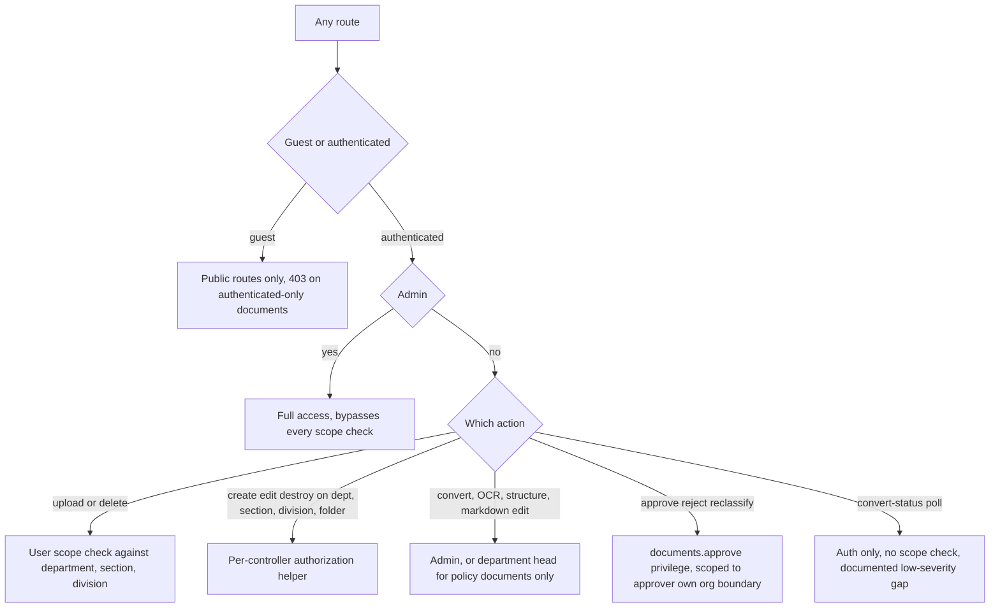
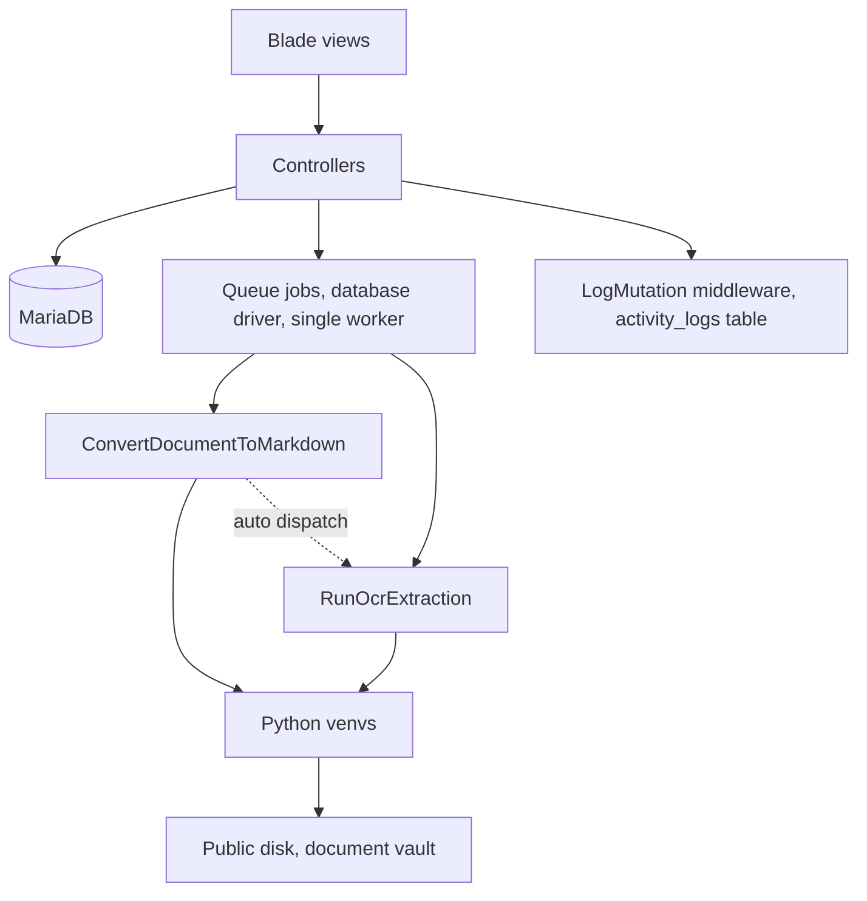

# Application Flow — Diagrams

**Date:** 2026-07-17
**Purpose:** Visual map of how a request moves through this app — upload, taxonomy resolution,
approval, conversion, review, verify/archive — plus authorization and the component map. Kept in
its own file since `README.md` is already long; linked from there. For the Markdown/OCR/structure
conversion pipeline specifically (Pass 1, Pass 0, splice, auto-OCR-trigger in full detail), see
the diagram in `OCR_RESEARCH.md` — not duplicated here, only referenced.

## 1. Document status lifecycle

Split into two diagrams — upload/approval, then conversion/verification — since one combined
diagram had too many crossing arrows to read cleanly.

**Upload and approval:**

`[*] --> pending_approval` fires when the uploader or the upload context (section/division/rule
set) requires approval; otherwise `[*] --> uploaded` fires directly. A checker moves
`pending_approval` to `uploaded` (approve) or `rejected` (reject, reason required); only the
original uploader can move `rejected` back to `pending_approval` (resubmit). See
`ApprovalController`.

**Conversion and verification** (picks up from `uploaded`):

- `uploaded --> processing`: reviewer clicks Convert to Markdown.
- `processing --> review`: text layer was readable (`ConvertDocumentToMarkdown`).
- `processing --> ocr_pending`: text layer was unreadable — OCR auto-dispatches, no click needed
  (M34, see `STRUCTURE_RESEARCH.md`).
- `review --> ocr_pending`: reviewer manually re-runs OCR with a different engine.
- `ocr_pending --> review`: `RunOcrExtraction` completes.
- either job throwing goes to `failed`; the Pipeline monitor's Retry button sends it back to
  `processing`.
- `review --> verified` and `uploaded --> verified` (skip conversion entirely, verify the
  text-layer-only document as-is) both go through `DocumentController::updateMarkdown()`.

Any status can be soft-deleted to `archived` and later restored back to its prior status —
omitted from the diagrams above to avoid an arrow from every node. `visibility`
(`public`/`authenticated`) is a separate, independent flag, not part of this state machine.

## 2. Upload — taxonomy resolution

Every upload resolves to exactly one of five contexts, which decides the vault path and the
document's foreign keys (`DocumentController::store()`):

Approval-required means either the uploader's `uploads_require_approval` flag or the context's
own `requires_approval` flag. Vault paths: rule-set docs (Acts/Rules and Policies alike) go under
`rules/RULE_SET_SLUG/`; the other four branches nest under the owning section's own directory —
see the vault tree in `README.md`. Each branch also picks a distinct
`Document::uniqueSlugForRuleSet()`/`ForFolder()`/`ForDivision()`/`ForSection()` method, so slug
collisions are scoped to the right parent, not globally.

## 3. Maker-checker approval flow

Approval scope follows the org hierarchy (section/department/global) — a checker only sees
submissions within their own scope, enforced in `ApprovalController::index()`'s query, not just
the UI.

## 4. Authorization — who can do what

`E` closes a real gap found in `SECURITY.md` H-04/H-05 (these routes had no authorization check
beyond the blanket `auth` middleware before that fix). `H` is the still-open `SECURITY.md` L-04
gap: any logged-in user can poll any document's conversion status by ID.

## 5. Component map

- **Blade** — `documents/show`, `documents/pipeline`, `documents/bulk-upload`, `approvals/index`,
  `admin/*`, etc.
- **Controllers** — `DocumentController`, `RuleSetController`, `ApprovalController`,
  `DepartmentController`/`SectionController`/`DivisionController`/`FolderController`.
- **MariaDB** — `departments`, `sections`, `divisions`, `folders`, `rule_sets`, `documents`,
  `document_status_histories`, `users`.
- **Python venvs** — `markitdown`/pdfminer (text layer), Docling (structure), Tesseract/EasyOCR/
  PaddleOCR/Surya (OCR), each in its own venv under `storage/app/private/ocr-engines/`.
- **Public disk** — `document_vault/.../SLUG.pdf` plus sibling `.md`, `.pre-ocr.md`, and
  `.structure.json` files once converted.
- The dotted edge is M34's auto-dispatch: `ConvertDocumentToMarkdown` queues `RunOcrExtraction`
  itself when the text layer is unreadable, instead of waiting for a reviewer to trigger it.

See `OCR_RESEARCH.md` for the conversion pipeline's own detailed flowchart (pass ordering, quality
checks, splice logic, auto-OCR-trigger) — this file stops at the component-boundary level to
avoid duplicating that diagram.
