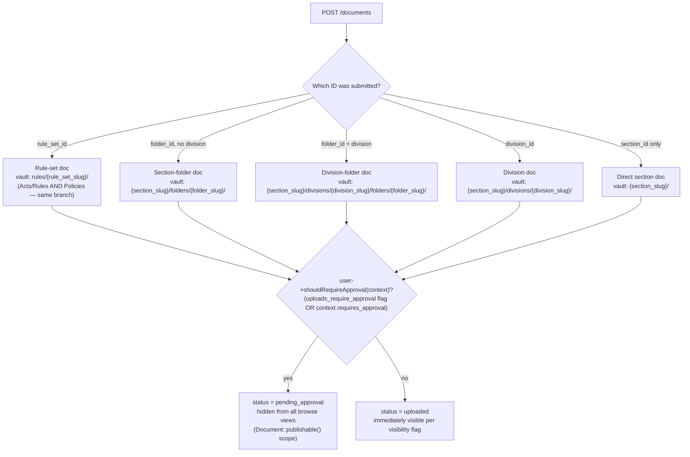
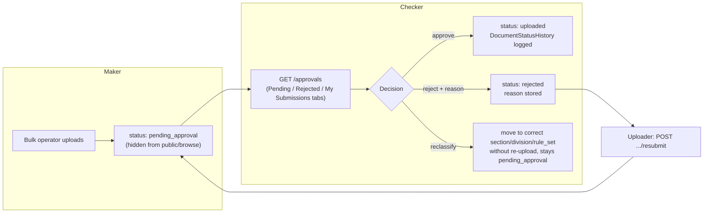
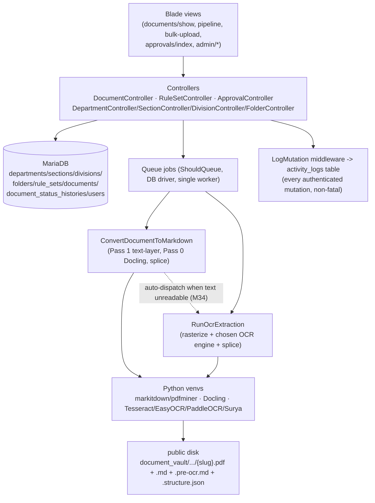

# Application Flow — Diagrams

**Date:** 2026-07-17
**Purpose:** Visual map of how a request moves through this app — upload → taxonomy resolution →
approval → conversion → review → verify/archive — plus authorization and the document data model.
Kept in its own file since `README.md` is already long; linked from there. For the
Markdown/OCR/structure conversion pipeline specifically (Pass 1/Pass 0/splice/auto-OCR-trigger in
full detail), see the diagram in `OCR_RESEARCH.md` — not duplicated here, only referenced.

## 1. Document lifecycle (status state machine)

```mermaid
stateDiagram-v2
    [*] --> pending_approval: upload, context/user requires approval
    [*] --> uploaded: upload, no approval required
    pending_approval --> uploaded: ApprovalController::approve()
    pending_approval --> rejected: ApprovalController::reject()
    rejected --> pending_approval: ApprovalController::resubmit() (uploader only)
    uploaded --> processing: DocumentController::convert()
    processing --> review: ConvertDocumentToMarkdown — good text layer
    processing --> ocr_pending: ConvertDocumentToMarkdown — text layer unreadable, auto-dispatches RunOcrExtraction (M34)
    processing --> failed: ConvertDocumentToMarkdown throws
    review --> ocr_pending: DocumentController::convertOcr() — reviewer manually re-runs OCR
    ocr_pending --> review: RunOcrExtraction completes
    ocr_pending --> failed: RunOcrExtraction throws
    failed --> processing: retry (Pipeline monitor "Retry" button)
    review --> verified: DocumentController::updateMarkdown(verify=true)
    uploaded --> verified: skip conversion, verify text-layer-only doc directly
    verified --> [*]
    uploaded --> archived: soft-delete (any status can be archived)
    review --> archived: soft-delete
    verified --> archived: soft-delete
    archived --> uploaded: DocumentController::restore() (status recalculated from what's on disk)
```

`visibility` (`public`/`authenticated`) is a separate, independent flag — not part of this state
machine — see `Document::$fillable` and `SECURITY.md`.

## 2. Upload — taxonomy resolution

Every upload resolves to exactly one of five contexts, which decides the vault path and the
document's foreign keys. `DocumentController::store()`:



Each branch also picks a distinct `Document::uniqueSlugFor*()` method (`ForRuleSet`/`ForFolder`/
`ForDivision`/`ForSection`) so slug collisions are scoped to the right parent, not globally.

## 3. Maker-checker approval flow



Approval scope follows the org hierarchy (section/department/global) — a checker only sees
submissions within their own scope, enforced in `ApprovalController::index()`'s query, not just
the UI.

## 4. Authorization — who can do what

```mermaid
flowchart TD
    R[Any route] --> A{Guest or authenticated?}
    A -->|guest| G["Public routes only\n(index/show/pdf where visibility=public)\n403 on visibility=authenticated docs"]
    A -->|authenticated| B{Admin?}
    B -->|yes| ALL[Full access — bypasses every privilege/scope check]
    B -->|no| C{Which action?}
    C -->|upload/delete| D["User::canUploadTo() / canDeleteFrom()\nchecked against department_id/section_id/division_id scope"]
    C -->|create/edit/destroy dept-sections-divisions-folders| E["Per-controller authorizeManage() helper\n(SECURITY.md H-04/H-05 fix — was previously unchecked)"]
    C -->|convert/OCR/structure/markdown edit on a document| F["canManageDocument():\nadmin, OR (ruleSet.kind===policy AND user.canManagePolicy())\n— non-policy documents: admin only"]
    C -->|approve/reject/reclassify| Gp["documents.approve privilege or admin,\nscoped to approver's own org boundary"]
    C -->|convert-status (poll)| H["Auth only — no scope check\n(SECURITY.md L-04, open low-severity gap)"]
```

## 5. Component map



See `OCR_RESEARCH.md` for the conversion pipeline's own detailed flowchart (Pass ordering,
quality checks, splice logic, auto-OCR-trigger) — this file stops at the component-boundary
level to avoid duplicating that diagram.
