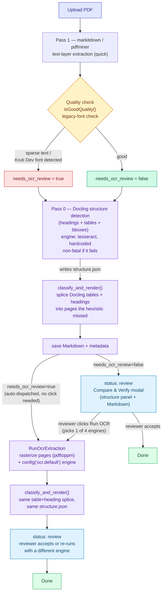

# OCR Engine Research — On-Premise Alternatives to Tesseract

**Date:** 2026-07-13 (last updated 2026-07-17)
**Status:** Live in production. Default extraction is `markitdown` (Microsoft, MIT, text-layer)
— fast and correct whenever a real text layer exists. When it's not good enough, a reviewer
picks one of **four selectable OCR engines** in the Compare & Verify modal: Tesseract
(Google/HP, default), EasyOCR (JaidedAI), PaddleOCR (Baidu), or Surya (VikParuchuri) — all wired
into `RunOcrExtraction`/`config/ocr.php`/`pdf_structure_extractor.py`. Structure detection
(tables/headings, a separate concern from character OCR) uses Docling (IBM) — see
`STRUCTURE_RESEARCH.md`.

## Current status (2026-07-17) — what's solid, what isn't

**Solid:**
- Text-layer extraction (`markitdown`/pdfminer) + 4-engine OCR fallback, all producing Markdown
  through the same heading/list/paragraph classifier — consistent output regardless of path.
- Docling structure detection (headings + tables + bboxes) runs on every document, fast, no LLM.
- Table splice (M33) and heading splice (M34): whenever the geometric heuristic finds zero tables
  or zero headings on a page that Docling detected some on, Docling's own recognized text fills
  the gap in the rendered Markdown — for both text-layer and OCR-derived documents.
- Legacy-font (Kruti Dev) detection forces OCR review instead of silently shipping corrupted text.
- Status-persistence bug fixed — a queued conversion no longer looks silently stalled.
- **Pipeline reorder + auto-OCR-trigger (M34):** the text-layer pass now runs *first* (it's the
  quick half of the job), so the quality/legacy-font check knows upfront whether OCR will be
  needed — no reviewer click required to find out. If it is needed, `RunOcrExtraction` is
  dispatched automatically at the end of `ConvertDocumentToMarkdown`, status goes straight to
  `ocr_pending` instead of stopping at `review` first. Docling's structure pass still runs either
  way, so both the text-layer and (if triggered) the OCR render get table+heading splicing.

**Not fixed yet:**
- **Duplicate table text on some OCR-derived documents** — see `STRUCTURE_RESEARCH.md`'s "known
  limitation." Confirmed still present on the real Odisha document: garbled OCR fragments of a
  table sit next to the correctly spliced Docling version, because those fragments never even
  reached the "candidate table" stage the de-dup check looks for. The same class of issue could in
  principle affect headings too (a garbled OCR fragment sitting next to a correctly spliced
  heading), but hasn't been observed yet — headings are single short lines, much less likely to
  fragment across a row-clustering boundary than a multi-column table is.
- **Docling's own structure-pass OCR engine is hardcoded to Tesseract** (`config('docling.
  default_ocr_engine')`), regardless of which OCR engine the reviewer picks for the main text, or
  which engine `RunOcrExtraction` ends up auto-triggered with. There's no UI control for it — only
  `structure_engine` on the job constructor, which nothing currently sets to anything but the
  default. See the recommendation right below — this is the one concrete, low-effort accuracy win
  not yet taken.
- **Heading level nesting from Docling is a guess, not exact.** Docling's structure.json gives a
  heading's text and page, not a real outline depth — `docling_heading_blocks()` infers depth from
  a numbered prefix (`1.2.1` → deeper) and otherwise defaults every unnumbered Docling heading to
  level 2. Good enough for review, not a guaranteed-correct outline.

## Docling can't call Paddle/Surya — can Tesseract/EasyOCR still be improved?

Yes, and it's a cheap, real lever that isn't pulled yet. Two independent angles:

1. **Docling's structure pass (table-cell-text accuracy) is still pinned to Tesseract.** Per
   `OCR_RESEARCH.md`'s own accuracy comparison, EasyOCR is measurably more accurate than Tesseract
   on this document class (digit corruption, conjunct artifacts, word hallucination). Since M33's
   table splice uses Docling's *own* recognized cell text, switching
   `config('docling.default_ocr_engine')` from `tesseract` to `easyocr` would directly improve
   spliced-table accuracy on scanned documents — one config line, no new code. Not done yet because
   nobody had looked at Docling's engine pin specifically until this question; worth doing.
2. **The main OCR pass (Tesseract/EasyOCR) itself has no further accuracy work identified beyond
   what's in this file** — the engine comparison here is what it is; the remaining known gap is
   PaddleOCR's Hindi-only recognition model (see "Open follow-ups" below), not Tesseract/EasyOCR
   quality.

## How the pipeline works today



Key points the diagram doesn't show directly:
- Pass 1 (text-layer) now runs **before** Pass 0 (Docling) — it's the quick half of the job, so
  the quality/legacy-font check is known before spending Docling's per-page time, and — if OCR
  turns out to be needed — it can be auto-dispatched immediately rather than waiting on a
  reviewer to notice the flag and click a button.
- Docling's Pass 0 is **additive and non-fatal** — if it errors or times out, the rest of the
  pipeline proceeds exactly as if structure detection never ran (`structure_analyzed: false`).
- The same `structure.json` (produced once, Pass 0) is reused by both the text-layer splice and
  any later OCR-engine splice — Docling never re-runs per OCR attempt.
- Both **tables and headings** are spliced (M33 + M34).

## Why this was investigated

Real gazette text (Devanagari) coming out via Tesseract showed digit corruption (`1904` →
`4904`), stray conjunct/halant artifacts, and silent substitution of plausible English words for
misread glyphs. Two on-prem alternatives were evaluated against the same page image to see if
either clears Tesseract's accuracy ceiling without unreasonable resource cost. Cloud OCR (Google
Vision/Azure) was excluded by choice, not architectural rule — CLAUDE.md's on-prem stance
reflects a real data-privacy requirement, but stays open for a future discussion if no on-prem
engine clears the bar.

## Verdict summary

| Engine | Verdict | Key tradeoff |
|---|---|---|
| Tesseract | Default | Fast, but accuracy issues above prompted this whole investigation |
| PaddleOCR | Adopted | Best accuracy+speed once two real bugs were fixed (below); dedicated Devanagari model |
| EasyOCR | Adopted | Clear accuracy win on Tesseract's failure modes; heavier (~4.4GB peak) |
| Surya | Wired in, impractical | Correct but a vision-LLM decode with no GPU here — too slow for full pages |

## PaddleOCR — two real bugs, both fixed

`pip install paddlepaddle paddleocr` in an isolated venv. Ships a dedicated
`devanagari_PP-OCRv5_mobile_rec` recognition model — a real point in its favor for Hindi. Two
bugs blocked it initially, both root-caused and fixed:

1. **Memory** — `lang="hi"` defaults to the server-tier `PP-OCRv5_server_det` model, which tried
   to consume nearly all available RAM on a single page. Fixed by pinning
   `text_detection_model_name="PP-OCRv5_mobile_det"` explicitly.
2. **Crash** — pinning the mobile model alone crashed with a Paddle-inference error. Root cause:
   PaddleX defaults to a broken oneDNN (MKL-DNN) CPU backend for text detection, unrelated to the
   model choice. Fixed by passing `enable_mkldnn=False`.

With both fixes, a real 54-page fully-scanned document (Odisha Excise Policy) ran end-to-end
through the app's queue worker in ~14.4 minutes (~16s/page), ~880% CPU, RSS steady at
0.9–1.6GB — no crash, no manual intervention. Now the recommended engine for bulk same-language
batches. Config: `config/ocr.php`, `pdf_structure_extractor.py`'s `extract_paddleocr_dir()`.

## EasyOCR — adopted for accuracy

`pip install easyocr` (needs `numpy<2` — its PyTorch stack isn't NumPy-2-ready). Peaked ~4.4GB
during detection, settled to ~700MB after — heavy but survivable. Side-by-side against
Tesseract on the same known trouble spots (UP Beer Retail Rules gazette):

| Issue | Tesseract | EasyOCR |
|---|---|---|
| Year 1904/1910 | `4904`/`4940` (wrong) | correct |
| Devanagari conjuncts | stray ZWJ/halant artifacts | clean |
| Word hallucination | substitutes plausible English words for misread glyphs | none observed |

Adopted as a selectable engine (own venv, `storage/app/private/ocr-engines/easyocr/`,
`config/ocr.php`, `extract_easyocr_dir()`). No engine-specific regressions since.

## Surya — wired in, impractical on this hardware

Current release (`surya-ocr` 0.21.1) is a vision-language model served via `llama.cpp`
(GGUF checkpoint, ~1.2GB), not the older torch-only pipeline expected. Server starts fine
(`libggml-cpu-x64.so` backend, extracted manually into
`storage/app/private/ocr-engines/surya/llama-cpp/` — no oneDNN issue here, that was PaddleOCR's
separate bug). The problem is throughput: a single dense gazette page didn't finish within
Surya's own 600s per-request timeout, CPU-only with no GPU loaded. Left enabled in the dropdown
(not broken, just slow for large pages) — a Vulkan backend for this box's iGPU is the untested,
more-promising path if this gets revisited.

## Reproducing a comparison

```bash
python3 -m venv /path/to/venv && /path/to/venv/bin/pip install easyocr "numpy<2"
pdftoppm -png -r 300 -f 1 -l 1 <pdf_path> /path/to/out/page   # rasterize page 1
# then run a small script calling easyocr.Reader(["hi","en"], gpu=False).readtext(...)
```
Watch memory with a polling loop (`ps -o rss= -p <pid>` every 2s) — PaddleOCR's default config
will otherwise consume the whole machine unattended if the mobile-model pin is ever dropped.

## Open follow-ups, not implemented

- **PaddleOCR is Hindi-only for recognition** (`devanagari_PP-OCRv5_mobile_rec`, no
  English-specific counterpart) — on a mixed Hindi/English page, English text runs through the
  same recognizer and may be misread. Not yet an observed problem (documents tested so far are
  Hindi- or English-dominant per page, not finely interleaved). If revisited, evaluating a
  multilingual PP-OCRv5 recognition variant needs the same rigor as the comparisons above — a
  real accuracy/memory test, not a blind config swap.
- **PaddleOCR CPU/thread tuning beyond current defaults** — the Odisha run already used ~880%
  CPU without explicit thread config; whether tuning `cpu_threads` further helps hasn't been
  tested.
